# IEMS Internal ERP — Normalized Database Schema Design

**Version:** 0.1  
**Database:** Supabase PostgreSQL  
**Application Architecture:** Next.js frontend + FastAPI backend + Supabase Auth + Supabase Storage  
**Design Goal:** A normalized, auditable, secure ERP schema for attendance, projects, digital documents, offline exports, physical archives, tasks, calendars, approvals, ABAC, and the Director Dashboard.

---

# 1. Design Principles

This schema is designed using standard DBMS principles:

- **1NF:** Every column stores an atomic value. Lists such as task assignees, project members, tags, roles, and event attendees are stored in junction tables.
- **2NF:** Attributes in junction tables depend on the full composite key.
- **3NF / BCNF:** Descriptive values such as department names, role names, project status labels, and document types are stored once in reference tables rather than repeated across transactional rows.
- **Referential integrity:** Foreign keys enforce valid relationships.
- **Entity integrity:** Every table has a primary key.
- **Domain integrity:** `CHECK`, `NOT NULL`, unique constraints, and reference tables prevent invalid states.
- **Auditability:** Sensitive changes are appended to an immutable audit trail.
- **Separation of concerns:** Supabase Storage stores file bytes; PostgreSQL stores metadata, hierarchy, permissions, and business state.
- **Least privilege:** Supabase RLS provides baseline database protection. FastAPI applies higher-level ABAC business rules.
- **Controlled denormalisation:** Derived dashboard summaries should use views or materialized views rather than duplicated editable data.

---

# 2. Important Modelling Decisions

## 2.1 Employee records and login identities are separate

An employee may exist before receiving a login. A login may also be disabled without deleting historical attendance, project, document, or audit records.

```text
employees
    1 ───── 0..1
user_accounts
```

Supabase Auth remains the identity provider. `user_accounts.auth_user_id` references `auth.users.id`.

## 2.2 Business identifiers and technical identifiers are separate

Use UUID primary keys internally. Use readable unique business keys for office work.

Examples:

```text
Employee UUID: internal database key
Employee Code: EMP-001

Project UUID: internal database key
Project Code: IEMS-2026-0042

Physical File UUID: internal database key
Physical File Code: PF-IEMS-2026-0042-01
```

## 2.3 Folder hierarchy lives in PostgreSQL

Human-readable folder structure is represented using an adjacency list:

```text
folders.parent_folder_id → folders.id
```

Actual file bytes live in Supabase Storage using immutable object keys.

## 2.4 Physical archive hierarchy also uses a tree

Rooms, racks, shelves, cabinets, boxes, and file slots are represented as nested locations.

```text
Room A
└── Rack R02
    └── Shelf S03
        └── Box B05
```

## 2.5 Stable attributes use normal columns

Do not use `jsonb` as a replacement for relational design. Use `jsonb` only for:

- flexible ABAC policy conditions
- audit-event payloads
- optional metadata that varies by document type
- generated job payloads

---

# 3. High-Level ER Diagram

```mermaid
erDiagram
    EMPLOYEES ||--o| USER_ACCOUNTS : has
    EMPLOYEES ||--o{ EMPLOYEE_DEPARTMENT_ASSIGNMENTS : assigned_to
    DEPARTMENTS ||--o{ EMPLOYEE_DEPARTMENT_ASSIGNMENTS : contains
    USER_ACCOUNTS ||--o{ USER_ROLE_ASSIGNMENTS : receives
    ROLES ||--o{ USER_ROLE_ASSIGNMENTS : grants
    ROLES ||--o{ ROLE_PERMISSIONS : contains
    PERMISSIONS ||--o{ ROLE_PERMISSIONS : maps

    CLIENTS ||--o{ CLIENT_CONTACTS : has
    CLIENTS ||--o{ PROJECTS : owns
    PROJECT_TYPES ||--o{ PROJECTS : classifies
    PROJECT_STATUSES ||--o{ PROJECTS : has
    EMPLOYEES ||--o{ PROJECT_MEMBERS : joins
    PROJECTS ||--o{ PROJECT_MEMBERS : includes

    PROJECTS ||--o{ FOLDERS : contains
    FOLDERS ||--o{ FOLDERS : nests
    FOLDERS ||--o{ DOCUMENTS : contains
    DOCUMENTS ||--o{ DOCUMENT_VERSIONS : versions
    DOCUMENTS ||--o{ DOCUMENT_TAG_ASSIGNMENTS : tagged
    TAGS ||--o{ DOCUMENT_TAG_ASSIGNMENTS : applies

    PROJECTS ||--o{ ARCHIVE_EXPORTS : exported
    ARCHIVE_EXPORTS ||--o{ ARCHIVE_EXPORT_ITEMS : includes
    DOCUMENT_VERSIONS ||--o{ ARCHIVE_EXPORT_ITEMS : captured

    ARCHIVE_ROOMS ||--o{ ARCHIVE_LOCATIONS : contains
    ARCHIVE_LOCATIONS ||--o{ ARCHIVE_LOCATIONS : nests
    PROJECTS ||--o{ PHYSICAL_FILES : archived_as
    ARCHIVE_LOCATIONS ||--o{ PHYSICAL_FILES : stores
    PHYSICAL_FILES ||--o{ PHYSICAL_FILE_CHECKOUTS : checked_out
    PHYSICAL_FILES ||--o{ ARCHIVE_VERIFICATIONS : verified

    EMPLOYEES ||--o{ ATTENDANCE_SESSIONS : logs
    EMPLOYEES ||--o{ LEAVE_REQUESTS : requests

    PROJECTS ||--o{ TASKS : has
    TASKS ||--o{ TASK_ASSIGNEES : assigned
    EMPLOYEES ||--o{ TASK_ASSIGNEES : receives
    TASKS ||--o{ TASK_COMMENTS : discussed

    PROJECTS ||--o{ CALENDAR_EVENTS : schedules
    CALENDAR_EVENTS ||--o{ CALENDAR_EVENT_ATTENDEES : includes
    EMPLOYEES ||--o{ CALENDAR_EVENT_ATTENDEES : attends

    APPROVAL_REQUESTS ||--o{ APPROVAL_ACTIONS : records
    EMPLOYEES ||--o{ APPROVAL_ACTIONS : performs

    USER_ACCOUNTS ||--o{ AUDIT_EVENTS : causes
```



---

# 4. Reference Tables

Reference tables avoid repeating labels and prevent update anomalies.

## `departments`

| Column | Type | Rules |
|---|---|---|
| `id` | uuid | PK |
| `code` | varchar(30) | UNIQUE, NOT NULL |
| `name` | varchar(100) | UNIQUE, NOT NULL |
| `is_active` | boolean | NOT NULL DEFAULT true |
| `created_at` | timestamptz | NOT NULL |

Examples: `OPS`, `ACCOUNTS`, `HR`, `ADMIN`, `MANAGEMENT`.

## `project_types`

| Column | Type | Rules |
|---|---|---|
| `id` | uuid | PK |
| `code` | varchar(40) | UNIQUE, NOT NULL |
| `name` | varchar(100) | UNIQUE, NOT NULL |
| `is_active` | boolean | NOT NULL DEFAULT true |

Examples: `CONFERENCE`, `EXHIBITION`, `PRODUCT_LAUNCH`, `GOVERNMENT_EVENT`.

## `project_statuses`

| Column | Type | Rules |
|---|---|---|
| `id` | uuid | PK |
| `code` | varchar(30) | UNIQUE, NOT NULL |
| `name` | varchar(80) | UNIQUE, NOT NULL |
| `sort_order` | integer | NOT NULL |
| `is_terminal` | boolean | NOT NULL DEFAULT false |

Examples: `PLANNING`, `ACTIVE`, `ON_HOLD`, `COMPLETED`, `ARCHIVED`, `CANCELLED`.

## `priority_levels`

| Column | Type | Rules |
|---|---|---|
| `id` | uuid | PK |
| `code` | varchar(20) | UNIQUE, NOT NULL |
| `name` | varchar(50) | UNIQUE, NOT NULL |
| `rank` | smallint | UNIQUE, NOT NULL |

Examples: `LOW`, `NORMAL`, `HIGH`, `URGENT`.

## `document_types`

| Column | Type | Rules |
|---|---|---|
| `id` | uuid | PK |
| `code` | varchar(50) | UNIQUE, NOT NULL |
| `name` | varchar(100) | UNIQUE, NOT NULL |
| `requires_approval` | boolean | NOT NULL DEFAULT false |
| `is_required_for_archive` | boolean | NOT NULL DEFAULT false |

Examples: `CLIENT_BRIEF`, `QUOTATION`, `WORK_ORDER`, `VENUE_APPROVAL`, `VENDOR_BILL`, `FINAL_INVOICE`.

## `confidentiality_levels`

| Column | Type | Rules |
|---|---|---|
| `id` | uuid | PK |
| `code` | varchar(30) | UNIQUE, NOT NULL |
| `name` | varchar(80) | UNIQUE, NOT NULL |
| `rank` | smallint | UNIQUE, NOT NULL |

Examples: `GENERAL`, `INTERNAL`, `CONFIDENTIAL`, `RESTRICTED`.

---

# 5. Identity, Employees, Roles, and ABAC

## `employees`

Stores the long-term employee record.

| Column | Type | Rules |
|---|---|---|
| `id` | uuid | PK |
| `employee_code` | varchar(30) | UNIQUE, NOT NULL |
| `full_name` | varchar(150) | NOT NULL |
| `official_email` | citext | UNIQUE, NOT NULL |
| `phone` | varchar(30) | NULL |
| `designation` | varchar(120) | NULL |
| `employment_status` | varchar(30) | NOT NULL, CHECK allowed values |
| `joined_on` | date | NULL |
| `left_on` | date | NULL |
| `created_at` | timestamptz | NOT NULL |
| `updated_at` | timestamptz | NOT NULL |

Constraints:

```sql
CHECK (left_on IS NULL OR joined_on IS NULL OR left_on >= joined_on)
```

## `user_accounts`

Maps Supabase Auth accounts to employees.

| Column | Type | Rules |
|---|---|---|
| `id` | uuid | PK, FK → `auth.users.id` |
| `employee_id` | uuid | UNIQUE, NOT NULL, FK → `employees.id` |
| `is_active` | boolean | NOT NULL DEFAULT true |
| `is_super_user` | boolean | NOT NULL DEFAULT false |
| `last_login_at` | timestamptz | NULL |
| `created_at` | timestamptz | NOT NULL |

The Director account:

```text
official_email = director@iemsnewdelhi.com
is_super_user = true
```

## `employee_department_assignments`

Stores department history instead of overwriting an employee's department.

| Column | Type | Rules |
|---|---|---|
| `id` | uuid | PK |
| `employee_id` | uuid | FK → `employees.id`, NOT NULL |
| `department_id` | uuid | FK → `departments.id`, NOT NULL |
| `valid_from` | date | NOT NULL |
| `valid_to` | date | NULL |
| `assigned_by` | uuid | FK → `employees.id`, NULL |

Constraint:

```sql
CHECK (valid_to IS NULL OR valid_to >= valid_from)
```

Partial unique index:

```sql
CREATE UNIQUE INDEX uq_employee_current_department
ON employee_department_assignments(employee_id)
WHERE valid_to IS NULL;
```

## `roles`

| Column | Type | Rules |
|---|---|---|
| `id` | uuid | PK |
| `code` | varchar(40) | UNIQUE, NOT NULL |
| `name` | varchar(100) | UNIQUE, NOT NULL |
| `description` | text | NULL |

Examples: `EMPLOYEE`, `MANAGER`, `ADMIN`, `SUPER_ADMIN`, `SUPER_USER`, `DIRECTOR`.

## `permissions`

| Column | Type | Rules |
|---|---|---|
| `id` | uuid | PK |
| `code` | varchar(100) | UNIQUE, NOT NULL |
| `description` | text | NULL |

Examples:

```text
project.view
project.manage
document.view
document.upload
document.download
archive.export
physical_file.checkout
attendance.correct
approval.approve
policy.manage
audit.view
```

## `role_permissions`

| Column | Type | Rules |
|---|---|---|
| `role_id` | uuid | PK part, FK → `roles.id` |
| `permission_id` | uuid | PK part, FK → `permissions.id` |

Primary key:

```sql
PRIMARY KEY (role_id, permission_id)
```

## `user_role_assignments`

| Column | Type | Rules |
|---|---|---|
| `user_account_id` | uuid | PK part, FK → `user_accounts.id` |
| `role_id` | uuid | PK part, FK → `roles.id` |
| `assigned_by` | uuid | FK → `user_accounts.id`, NULL |
| `assigned_at` | timestamptz | NOT NULL |
| `expires_at` | timestamptz | NULL |

Primary key:

```sql
PRIMARY KEY (user_account_id, role_id)
```

## `attribute_definitions`

Defines optional ABAC attributes.

| Column | Type | Rules |
|---|---|---|
| `id` | uuid | PK |
| `entity_type` | varchar(40) | NOT NULL |
| `attribute_key` | varchar(100) | NOT NULL |
| `value_type` | varchar(30) | NOT NULL |
| `is_multivalued` | boolean | NOT NULL DEFAULT false |
| `description` | text | NULL |

Unique constraint:

```sql
UNIQUE(entity_type, attribute_key)
```

## `employee_attribute_values`

| Column | Type | Rules |
|---|---|---|
| `id` | uuid | PK |
| `employee_id` | uuid | FK → `employees.id`, NOT NULL |
| `attribute_definition_id` | uuid | FK → `attribute_definitions.id`, NOT NULL |
| `value` | jsonb | NOT NULL |
| `valid_from` | timestamptz | NOT NULL |
| `valid_to` | timestamptz | NULL |

Use this only for flexible ABAC attributes such as:

```text
can_manage_archive = true
clearance_level = restricted
```

Stable fields remain normal columns.

## `policies`

Stores FastAPI ABAC policy definitions.

| Column | Type | Rules |
|---|---|---|
| `id` | uuid | PK |
| `name` | varchar(150) | UNIQUE, NOT NULL |
| `action_code` | varchar(100) | NOT NULL |
| `effect` | varchar(10) | NOT NULL, CHECK `ALLOW` or `DENY` |
| `priority` | integer | NOT NULL DEFAULT 100 |
| `conditions` | jsonb | NOT NULL |
| `is_active` | boolean | NOT NULL DEFAULT true |
| `created_by` | uuid | FK → `user_accounts.id`, NOT NULL |
| `created_at` | timestamptz | NOT NULL |
| `updated_at` | timestamptz | NOT NULL |

## `super_user_overrides`

| Column | Type | Rules |
|---|---|---|
| `id` | uuid | PK |
| `user_account_id` | uuid | FK → `user_accounts.id`, NOT NULL |
| `action_code` | varchar(100) | NOT NULL |
| `resource_type` | varchar(50) | NOT NULL |
| `resource_id` | uuid | NOT NULL |
| `reason` | text | NOT NULL |
| `created_at` | timestamptz | NOT NULL |

Rule: a Super User override is never silent. It must always create an audit event.

---

# 6. Clients and Projects

## `clients`

| Column | Type | Rules |
|---|---|---|
| `id` | uuid | PK |
| `client_code` | varchar(30) | UNIQUE, NOT NULL |
| `legal_name` | varchar(200) | NOT NULL |
| `display_name` | varchar(150) | NOT NULL |
| `is_active` | boolean | NOT NULL DEFAULT true |
| `notes` | text | NULL |
| `created_at` | timestamptz | NOT NULL |
| `updated_at` | timestamptz | NOT NULL |

## `client_contacts`

One client may have multiple contacts.

| Column | Type | Rules |
|---|---|---|
| `id` | uuid | PK |
| `client_id` | uuid | FK → `clients.id`, NOT NULL |
| `full_name` | varchar(150) | NOT NULL |
| `email` | citext | NULL |
| `phone` | varchar(30) | NULL |
| `designation` | varchar(100) | NULL |
| `is_primary` | boolean | NOT NULL DEFAULT false |

Partial unique index:

```sql
CREATE UNIQUE INDEX uq_one_primary_contact_per_client
ON client_contacts(client_id)
WHERE is_primary = true;
```

## `projects`

| Column | Type | Rules |
|---|---|---|
| `id` | uuid | PK |
| `project_code` | varchar(40) | UNIQUE, NOT NULL |
| `client_id` | uuid | FK → `clients.id`, NOT NULL |
| `project_type_id` | uuid | FK → `project_types.id`, NOT NULL |
| `project_status_id` | uuid | FK → `project_statuses.id`, NOT NULL |
| `priority_level_id` | uuid | FK → `priority_levels.id`, NOT NULL |
| `name` | varchar(200) | NOT NULL |
| `event_date` | date | NULL |
| `venue` | varchar(250) | NULL |
| `description` | text | NULL |
| `project_manager_id` | uuid | FK → `employees.id`, NULL |
| `created_by` | uuid | FK → `employees.id`, NOT NULL |
| `created_at` | timestamptz | NOT NULL |
| `updated_at` | timestamptz | NOT NULL |
| `archived_at` | timestamptz | NULL |

## `project_members`

| Column | Type | Rules |
|---|---|---|
| `project_id` | uuid | PK part, FK → `projects.id` |
| `employee_id` | uuid | PK part, FK → `employees.id` |
| `access_level` | varchar(20) | NOT NULL, CHECK allowed values |
| `assigned_by` | uuid | FK → `employees.id`, NOT NULL |
| `assigned_at` | timestamptz | NOT NULL |
| `removed_at` | timestamptz | NULL |

Primary key:

```sql
PRIMARY KEY (project_id, employee_id)
```

Allowed access levels:

```text
VIEW
CONTRIBUTE
MANAGE
```

---

# 7. Folder Templates and Digital Folder Hierarchy

## `folder_templates`

| Column | Type | Rules |
|---|---|---|
| `id` | uuid | PK |
| `name` | varchar(150) | UNIQUE, NOT NULL |
| `project_type_id` | uuid | FK → `project_types.id`, NULL |
| `is_active` | boolean | NOT NULL DEFAULT true |
| `created_by` | uuid | FK → `employees.id`, NOT NULL |
| `created_at` | timestamptz | NOT NULL |

## `folder_template_items`

Self-referencing table for nested template folders.

| Column | Type | Rules |
|---|---|---|
| `id` | uuid | PK |
| `template_id` | uuid | FK → `folder_templates.id`, NOT NULL |
| `parent_item_id` | uuid | FK → `folder_template_items.id`, NULL |
| `name` | varchar(200) | NOT NULL |
| `sort_order` | integer | NOT NULL DEFAULT 0 |

Unique index:

```sql
CREATE UNIQUE INDEX uq_template_sibling_folder_name
ON folder_template_items(template_id, parent_item_id, lower(name));
```

## `folders`

Stores the actual folder tree.

| Column | Type | Rules |
|---|---|---|
| `id` | uuid | PK |
| `project_id` | uuid | FK → `projects.id`, NOT NULL |
| `parent_folder_id` | uuid | FK → `folders.id`, NULL |
| `name` | varchar(255) | NOT NULL |
| `sort_order` | integer | NOT NULL DEFAULT 0 |
| `created_by` | uuid | FK → `employees.id`, NOT NULL |
| `created_at` | timestamptz | NOT NULL |
| `updated_at` | timestamptz | NOT NULL |
| `deleted_at` | timestamptz | NULL |

Indexes:

```sql
CREATE UNIQUE INDEX uq_folder_sibling_name
ON folders(project_id, parent_folder_id, lower(name))
WHERE deleted_at IS NULL;

CREATE UNIQUE INDEX uq_project_root_folder
ON folders(project_id)
WHERE parent_folder_id IS NULL AND deleted_at IS NULL;
```

Rule: The backend must reject folder moves that would create a cycle.

For the MVP, query descendants using recursive CTEs. If hierarchy queries become heavy, add a derived closure table or PostgreSQL `ltree` path column later.

---

# 8. Documents and Versions

## `documents`

Represents the logical document.

| Column | Type | Rules |
|---|---|---|
| `id` | uuid | PK |
| `project_id` | uuid | FK → `projects.id`, NOT NULL |
| `folder_id` | uuid | FK → `folders.id`, NOT NULL |
| `document_type_id` | uuid | FK → `document_types.id`, NULL |
| `confidentiality_level_id` | uuid | FK → `confidentiality_levels.id`, NOT NULL |
| `display_name` | varchar(255) | NOT NULL |
| `status` | varchar(30) | NOT NULL DEFAULT `ACTIVE` |
| `created_by` | uuid | FK → `employees.id`, NOT NULL |
| `created_at` | timestamptz | NOT NULL |
| `updated_at` | timestamptz | NOT NULL |
| `deleted_at` | timestamptz | NULL |

Unique index:

```sql
CREATE UNIQUE INDEX uq_document_name_in_folder
ON documents(folder_id, lower(display_name))
WHERE deleted_at IS NULL;
```

## `document_versions`

Represents immutable uploaded file versions.

| Column | Type | Rules |
|---|---|---|
| `id` | uuid | PK |
| `document_id` | uuid | FK → `documents.id`, NOT NULL |
| `version_number` | integer | NOT NULL |
| `storage_bucket` | varchar(100) | NOT NULL |
| `storage_key` | text | UNIQUE, NOT NULL |
| `original_filename` | varchar(255) | NOT NULL |
| `mime_type` | varchar(150) | NOT NULL |
| `size_bytes` | bigint | NOT NULL, CHECK `size_bytes >= 0` |
| `checksum_sha256` | char(64) | NOT NULL |
| `change_note` | text | NULL |
| `uploaded_by` | uuid | FK → `employees.id`, NOT NULL |
| `uploaded_at` | timestamptz | NOT NULL |

Constraint:

```sql
UNIQUE(document_id, version_number)
```

Important rule:

```text
Document versions are immutable.
A correction creates a new version instead of overwriting the old version.
```

## `tags`

| Column | Type | Rules |
|---|---|---|
| `id` | uuid | PK |
| `name` | citext | UNIQUE, NOT NULL |

## `document_tag_assignments`

| Column | Type | Rules |
|---|---|---|
| `document_id` | uuid | PK part, FK → `documents.id` |
| `tag_id` | uuid | PK part, FK → `tags.id` |

Primary key:

```sql
PRIMARY KEY(document_id, tag_id)
```

## `document_metadata`

Optional type-specific metadata.

| Column | Type | Rules |
|---|---|---|
| `document_id` | uuid | PK, FK → `documents.id` |
| `metadata` | jsonb | NOT NULL DEFAULT `{}` |

Use only for optional values that do not justify dedicated tables.

---

# 9. Archive Exports and Offline Packages

## `archive_exports`

Each generated offline archive is recorded.

| Column | Type | Rules |
|---|---|---|
| `id` | uuid | PK |
| `project_id` | uuid | FK → `projects.id`, NOT NULL |
| `export_number` | integer | NOT NULL |
| `requested_by` | uuid | FK → `employees.id`, NOT NULL |
| `status` | varchar(30) | NOT NULL |
| `storage_bucket` | varchar(100) | NULL |
| `storage_key` | text | NULL |
| `manifest_checksum_sha256` | char(64) | NULL |
| `requested_at` | timestamptz | NOT NULL |
| `completed_at` | timestamptz | NULL |

Constraint:

```sql
UNIQUE(project_id, export_number)
```

Statuses:

```text
QUEUED
GENERATING
READY
FAILED
EXPIRED
```

## `archive_export_items`

Records the exact versions included in a ZIP. This makes exports reproducible and auditable.

| Column | Type | Rules |
|---|---|---|
| `archive_export_id` | uuid | PK part, FK → `archive_exports.id` |
| `document_version_id` | uuid | PK part, FK → `document_versions.id` |
| `relative_path` | text | NOT NULL |
| `checksum_sha256` | char(64) | NOT NULL |

Primary key:

```sql
PRIMARY KEY(archive_export_id, document_version_id)
```

---

# 10. Physical Archive and Records Room

## `archive_rooms`

| Column | Type | Rules |
|---|---|---|
| `id` | uuid | PK |
| `code` | varchar(30) | UNIQUE, NOT NULL |
| `name` | varchar(120) | UNIQUE, NOT NULL |
| `description` | text | NULL |
| `is_active` | boolean | NOT NULL DEFAULT true |

## `archive_locations`

Nested physical storage structure.

| Column | Type | Rules |
|---|---|---|
| `id` | uuid | PK |
| `archive_room_id` | uuid | FK → `archive_rooms.id`, NOT NULL |
| `parent_location_id` | uuid | FK → `archive_locations.id`, NULL |
| `location_type` | varchar(30) | NOT NULL |
| `code` | varchar(50) | NOT NULL |
| `label` | varchar(120) | NULL |
| `qr_token` | uuid | UNIQUE, NOT NULL |
| `is_active` | boolean | NOT NULL DEFAULT true |

Allowed location types:

```text
RACK
SHELF
CABINET
BOX
FILE_SLOT
```

Unique constraint:

```sql
UNIQUE(archive_room_id, parent_location_id, location_type, code)
```

Rule: the backend must reject physical-location moves that create a hierarchy cycle.

## `physical_files`

| Column | Type | Rules |
|---|---|---|
| `id` | uuid | PK |
| `physical_file_code` | varchar(60) | UNIQUE, NOT NULL |
| `project_id` | uuid | FK → `projects.id`, NOT NULL |
| `archive_location_id` | uuid | FK → `archive_locations.id`, NOT NULL |
| `volume_number` | integer | NOT NULL DEFAULT 1 |
| `status` | varchar(30) | NOT NULL |
| `qr_token` | uuid | UNIQUE, NOT NULL |
| `archived_on` | date | NULL |
| `archived_by` | uuid | FK → `employees.id`, NULL |
| `last_verified_at` | timestamptz | NULL |
| `next_verification_at` | timestamptz | NULL |
| `notes` | text | NULL |
| `created_at` | timestamptz | NOT NULL |
| `updated_at` | timestamptz | NOT NULL |

Constraint:

```sql
UNIQUE(project_id, volume_number)
```

Statuses:

```text
AVAILABLE
CHECKED_OUT
MISSING
UNDER_VERIFICATION
ARCHIVED
```

## `physical_file_checkouts`

| Column | Type | Rules |
|---|---|---|
| `id` | uuid | PK |
| `physical_file_id` | uuid | FK → `physical_files.id`, NOT NULL |
| `checked_out_by` | uuid | FK → `employees.id`, NOT NULL |
| `checked_out_at` | timestamptz | NOT NULL |
| `purpose` | text | NOT NULL |
| `expected_return_at` | timestamptz | NULL |
| `returned_at` | timestamptz | NULL |
| `returned_to_location_id` | uuid | FK → `archive_locations.id`, NULL |
| `received_by` | uuid | FK → `employees.id`, NULL |
| `remarks` | text | NULL |

Partial unique index:

```sql
CREATE UNIQUE INDEX uq_one_open_checkout_per_physical_file
ON physical_file_checkouts(physical_file_id)
WHERE returned_at IS NULL;
```

## `physical_file_movements`

Tracks changes in physical location.

| Column | Type | Rules |
|---|---|---|
| `id` | uuid | PK |
| `physical_file_id` | uuid | FK → `physical_files.id`, NOT NULL |
| `from_location_id` | uuid | FK → `archive_locations.id`, NULL |
| `to_location_id` | uuid | FK → `archive_locations.id`, NULL |
| `movement_type` | varchar(30) | NOT NULL |
| `performed_by` | uuid | FK → `employees.id`, NOT NULL |
| `remarks` | text | NULL |
| `created_at` | timestamptz | NOT NULL |

Movement types:

```text
ARCHIVE
MOVE
CHECKOUT
RETURN
CORRECTION
```

## `archive_verifications`

| Column | Type | Rules |
|---|---|---|
| `id` | uuid | PK |
| `physical_file_id` | uuid | FK → `physical_files.id`, NOT NULL |
| `verified_by` | uuid | FK → `employees.id`, NOT NULL |
| `verified_at` | timestamptz | NOT NULL |
| `location_correct` | boolean | NOT NULL |
| `label_readable` | boolean | NOT NULL |
| `physical_file_present` | boolean | NOT NULL |
| `digital_archive_present` | boolean | NOT NULL |
| `documents_complete` | boolean | NOT NULL |
| `remarks` | text | NULL |

---

# 11. Attendance and Leave

## `attendance_sessions`

Use multiple sessions instead of one check-in/check-out pair per day. This supports breaks, site visits, and corrections.

| Column | Type | Rules |
|---|---|---|
| `id` | uuid | PK |
| `employee_id` | uuid | FK → `employees.id`, NOT NULL |
| `checked_in_at` | timestamptz | NOT NULL |
| `checked_out_at` | timestamptz | NULL |
| `source` | varchar(30) | NOT NULL |
| `remarks` | text | NULL |
| `created_by` | uuid | FK → `employees.id`, NOT NULL |
| `corrected_by` | uuid | FK → `employees.id`, NULL |
| `correction_reason` | text | NULL |
| `created_at` | timestamptz | NOT NULL |
| `updated_at` | timestamptz | NOT NULL |

Constraint:

```sql
CHECK (checked_out_at IS NULL OR checked_out_at >= checked_in_at)
```

Partial unique index:

```sql
CREATE UNIQUE INDEX uq_one_open_attendance_session_per_employee
ON attendance_sessions(employee_id)
WHERE checked_out_at IS NULL;
```

## `leave_types`

| Column | Type | Rules |
|---|---|---|
| `id` | uuid | PK |
| `code` | varchar(30) | UNIQUE, NOT NULL |
| `name` | varchar(80) | UNIQUE, NOT NULL |
| `is_paid` | boolean | NOT NULL DEFAULT true |

## `leave_requests`

| Column | Type | Rules |
|---|---|---|
| `id` | uuid | PK |
| `employee_id` | uuid | FK → `employees.id`, NOT NULL |
| `leave_type_id` | uuid | FK → `leave_types.id`, NOT NULL |
| `start_date` | date | NOT NULL |
| `end_date` | date | NOT NULL |
| `reason` | text | NOT NULL |
| `status` | varchar(30) | NOT NULL |
| `requested_at` | timestamptz | NOT NULL |
| `reviewed_by` | uuid | FK → `employees.id`, NULL |
| `reviewed_at` | timestamptz | NULL |
| `review_comment` | text | NULL |

Constraint:

```sql
CHECK(end_date >= start_date)
```

Statuses:

```text
PENDING
APPROVED
REJECTED
CANCELLED
```

## `attendance_daily_summary_v`

Use a view rather than a table for daily totals.

Derived fields:

```text
employee_id
attendance_date
first_check_in
last_check_out
total_minutes
open_session_count
```

A materialized view can be added later if reporting becomes slow.

---

# 12. Tasks and Calendar

## `task_statuses`

| Column | Type | Rules |
|---|---|---|
| `id` | uuid | PK |
| `code` | varchar(30) | UNIQUE, NOT NULL |
| `name` | varchar(80) | UNIQUE, NOT NULL |
| `is_terminal` | boolean | NOT NULL DEFAULT false |

Examples: `TODO`, `IN_PROGRESS`, `BLOCKED`, `COMPLETED`, `CANCELLED`.

## `tasks`

| Column | Type | Rules |
|---|---|---|
| `id` | uuid | PK |
| `project_id` | uuid | FK → `projects.id`, NULL |
| `related_folder_id` | uuid | FK → `folders.id`, NULL |
| `title` | varchar(250) | NOT NULL |
| `description` | text | NULL |
| `task_status_id` | uuid | FK → `task_statuses.id`, NOT NULL |
| `priority_level_id` | uuid | FK → `priority_levels.id`, NOT NULL |
| `created_by` | uuid | FK → `employees.id`, NOT NULL |
| `due_at` | timestamptz | NULL |
| `completed_at` | timestamptz | NULL |
| `created_at` | timestamptz | NOT NULL |
| `updated_at` | timestamptz | NOT NULL |

## `task_assignees`

Supports multiple assignees.

| Column | Type | Rules |
|---|---|---|
| `task_id` | uuid | PK part, FK → `tasks.id` |
| `employee_id` | uuid | PK part, FK → `employees.id` |
| `assigned_by` | uuid | FK → `employees.id`, NOT NULL |
| `assigned_at` | timestamptz | NOT NULL |

## `task_comments`

| Column | Type | Rules |
|---|---|---|
| `id` | uuid | PK |
| `task_id` | uuid | FK → `tasks.id`, NOT NULL |
| `employee_id` | uuid | FK → `employees.id`, NOT NULL |
| `comment_text` | text | NOT NULL |
| `created_at` | timestamptz | NOT NULL |
| `edited_at` | timestamptz | NULL |

## `task_document_links`

| Column | Type | Rules |
|---|---|---|
| `task_id` | uuid | PK part, FK → `tasks.id` |
| `document_id` | uuid | PK part, FK → `documents.id` |

## `calendar_events`

| Column | Type | Rules |
|---|---|---|
| `id` | uuid | PK |
| `project_id` | uuid | FK → `projects.id`, NULL |
| `related_task_id` | uuid | FK → `tasks.id`, NULL |
| `event_type` | varchar(40) | NOT NULL |
| `title` | varchar(250) | NOT NULL |
| `description` | text | NULL |
| `starts_at` | timestamptz | NOT NULL |
| `ends_at` | timestamptz | NULL |
| `location` | varchar(250) | NULL |
| `created_by` | uuid | FK → `employees.id`, NOT NULL |
| `created_at` | timestamptz | NOT NULL |
| `updated_at` | timestamptz | NOT NULL |

Constraint:

```sql
CHECK(ends_at IS NULL OR ends_at >= starts_at)
```

## `calendar_event_attendees`

| Column | Type | Rules |
|---|---|---|
| `calendar_event_id` | uuid | PK part, FK → `calendar_events.id` |
| `employee_id` | uuid | PK part, FK → `employees.id` |
| `response_status` | varchar(30) | NOT NULL |

---

# 13. Approvals

Avoid a weak polymorphic `resource_type + resource_id` design for approval requests because it cannot enforce foreign-key integrity.

## `approval_types`

| Column | Type | Rules |
|---|---|---|
| `id` | uuid | PK |
| `code` | varchar(50) | UNIQUE, NOT NULL |
| `name` | varchar(100) | UNIQUE, NOT NULL |

Examples: `DOCUMENT_APPROVAL`, `PROJECT_CLOSURE`, `ARCHIVE_CLOSURE`, `LEAVE_APPROVAL`.

## `approval_requests`

| Column | Type | Rules |
|---|---|---|
| `id` | uuid | PK |
| `approval_type_id` | uuid | FK → `approval_types.id`, NOT NULL |
| `project_id` | uuid | FK → `projects.id`, NULL |
| `document_version_id` | uuid | FK → `document_versions.id`, NULL |
| `archive_export_id` | uuid | FK → `archive_exports.id`, NULL |
| `leave_request_id` | uuid | FK → `leave_requests.id`, NULL |
| `requested_by` | uuid | FK → `employees.id`, NOT NULL |
| `assigned_to` | uuid | FK → `employees.id`, NULL |
| `status` | varchar(30) | NOT NULL |
| `requested_at` | timestamptz | NOT NULL |
| `completed_at` | timestamptz | NULL |

Constraint:

```sql
CHECK (
  num_nonnulls(project_id, document_version_id, archive_export_id, leave_request_id) = 1
)
```

Statuses:

```text
PENDING
APPROVED
REJECTED
REVISION_REQUESTED
CANCELLED
```

## `approval_actions`

| Column | Type | Rules |
|---|---|---|
| `id` | uuid | PK |
| `approval_request_id` | uuid | FK → `approval_requests.id`, NOT NULL |
| `action` | varchar(30) | NOT NULL |
| `performed_by` | uuid | FK → `employees.id`, NOT NULL |
| `comment` | text | NULL |
| `created_at` | timestamptz | NOT NULL |

---

# 14. Audit Logs and Notifications

## `audit_events`

Append-only table.

| Column | Type | Rules |
|---|---|---|
| `id` | uuid | PK |
| `actor_user_account_id` | uuid | FK → `user_accounts.id`, NULL |
| `actor_employee_id` | uuid | FK → `employees.id`, NULL |
| `action_code` | varchar(100) | NOT NULL |
| `resource_type` | varchar(60) | NOT NULL |
| `resource_id` | uuid | NULL |
| `request_id` | uuid | NULL |
| `old_values` | jsonb | NULL |
| `new_values` | jsonb | NULL |
| `metadata` | jsonb | NULL |
| `ip_address` | inet | NULL |
| `user_agent` | text | NULL |
| `created_at` | timestamptz | NOT NULL |

Examples:

```text
document.uploaded
document.version_created
archive.export_generated
physical_file.checked_out
physical_file.returned
physical_file.location_changed
attendance.corrected
approval.approved
policy.changed
super_user.override_used
```

Rules:

- No application user can update audit events.
- No application user can delete audit events.
- Sensitive actions must write an audit event in the same database transaction as the business change.

## `notifications`

| Column | Type | Rules |
|---|---|---|
| `id` | uuid | PK |
| `employee_id` | uuid | FK → `employees.id`, NOT NULL |
| `notification_type` | varchar(50) | NOT NULL |
| `title` | varchar(200) | NOT NULL |
| `message` | text | NOT NULL |
| `resource_type` | varchar(60) | NULL |
| `resource_id` | uuid | NULL |
| `read_at` | timestamptz | NULL |
| `created_at` | timestamptz | NOT NULL |

---

# 15. Director Dashboard Views

The Director Dashboard should read from views rather than duplicating transactional data.

## Suggested views

```text
director_project_health_v
director_attendance_today_v
director_pending_approvals_v
director_overdue_tasks_v
director_physical_file_status_v
director_archive_verification_due_v
director_recent_audit_events_v
```

## Example: `director_project_health_v`

Derived fields:

```text
project_id
project_code
client_name
project_name
event_date
project_manager_name
project_status
required_document_count
uploaded_required_document_count
archive_readiness_percent
open_task_count
overdue_task_count
pending_approval_count
physical_file_status
```

Do not store `archive_readiness_percent` directly unless performance measurements justify it. Calculate it from required documents through a view.

---

# 16. Search Design

Use PostgreSQL search before adding a separate search service.

## Searchable fields

```text
projects.project_code
projects.name
clients.display_name
folders.name
documents.display_name
document_versions.original_filename
tags.name
physical_files.physical_file_code
archive_locations.code
```

## Recommended extensions

```sql
CREATE EXTENSION IF NOT EXISTS citext;
CREATE EXTENSION IF NOT EXISTS pg_trgm;
```

## Trigram indexes

```sql
CREATE INDEX idx_projects_name_trgm
ON projects USING gin (name gin_trgm_ops);

CREATE INDEX idx_clients_display_name_trgm
ON clients USING gin (display_name gin_trgm_ops);

CREATE INDEX idx_documents_display_name_trgm
ON documents USING gin (display_name gin_trgm_ops);
```

## Full-text search

Create a generated or maintained search vector for combined project and document search if needed later.

---

# 17. Delete Behaviour

Use careful foreign-key delete rules.

| Relationship | Recommended behaviour |
|---|---|
| employee → attendance | `RESTRICT` |
| employee → audit logs | `RESTRICT` |
| project → folders | `RESTRICT` or soft delete |
| folder → child folders | `RESTRICT` |
| folder → documents | `RESTRICT` |
| document → document versions | `RESTRICT` |
| project → project members | `CASCADE` |
| task → task assignees | `CASCADE` |
| document → tag assignments | `CASCADE` |
| role → role permissions | `CASCADE` |
| physical file → checkouts | `RESTRICT` |
| archive export → export items | `CASCADE` |

Use soft deletion for:

```text
projects
folders
documents
employees
```

Never hard-delete records that matter for audit history.

---

# 18. Transaction Boundaries

Use ACID transactions for multi-step operations.

## Example: upload a new document version

```text
BEGIN
  validate ABAC permission
  insert document version metadata
  write audit event
  update derived search metadata if required
COMMIT
```

The Storage upload should use a compensating action if the object upload succeeds but the database transaction fails.

## Example: physical file checkout

```text
BEGIN
  confirm no open checkout exists
  insert physical_file_checkouts row
  update physical_files.status = CHECKED_OUT
  insert physical_file_movements row
  write audit event
COMMIT
```

Use database constraints in addition to application checks to prevent race-condition errors.

---

# 19. Indexing Strategy

PostgreSQL automatically indexes primary keys and unique constraints. Add indexes to foreign-key columns that appear frequently in joins and filters.

## Required indexes

```text
employee_department_assignments(employee_id)
project_members(employee_id)
projects(client_id)
projects(project_manager_id)
folders(project_id)
folders(parent_folder_id)
documents(folder_id)
documents(project_id)
document_versions(document_id)
archive_exports(project_id)
archive_locations(parent_location_id)
physical_files(project_id)
physical_files(archive_location_id)
physical_file_checkouts(physical_file_id)
attendance_sessions(employee_id, checked_in_at)
tasks(project_id)
task_assignees(employee_id)
approval_requests(status, assigned_to)
audit_events(created_at)
notifications(employee_id, read_at)
```

Add partial indexes for frequently queried active rows:

```sql
CREATE INDEX idx_pending_approvals
ON approval_requests(assigned_to, requested_at)
WHERE status = 'PENDING';

CREATE INDEX idx_unread_notifications
ON notifications(employee_id, created_at DESC)
WHERE read_at IS NULL;

CREATE INDEX idx_active_documents
ON documents(project_id, folder_id)
WHERE deleted_at IS NULL;
```

---

# 20. Supabase RLS Baseline

Use Supabase RLS for baseline defense-in-depth.

## Examples

- Employees can read their own employee profile.
- Employees can read their own attendance sessions.
- Employees can read projects where they are active project members.
- Employees can read documents belonging to accessible projects.
- Only approved backend service-role operations can generate archive ZIP files.
- The Director Super User account has broad access, but sensitive override actions still require FastAPI logging.

Complex decisions belong in FastAPI ABAC. RLS remains the database safety net.

---

# 21. Normalization Review

## 1NF

No repeated groups:

```text
WRONG: projects.assigned_employee_ids = [uuid1, uuid2]
RIGHT: project_members(project_id, employee_id)
```

## 2NF

Junction attributes depend on the complete composite key:

```text
project_members.access_level
depends on:
(project_id, employee_id)
```

## 3NF / BCNF

Descriptions are stored once:

```text
WRONG: projects.status_name repeated in every project
RIGHT: projects.project_status_id → project_statuses.id
```

```text
WRONG: employees.department_name repeated in every employee row
RIGHT: employee_department_assignments.department_id → departments.id
```

## Multivalued attributes

Use junction tables:

```text
task_assignees
project_members
user_role_assignments
document_tag_assignments
calendar_event_attendees
```

## Derived data

Use views:

```text
attendance_daily_summary_v
director_project_health_v
```

Do not store editable duplicates of derived values.

## Controlled JSON usage

Allowed:

```text
policies.conditions
audit_events.metadata
document_metadata.metadata
```

Avoid:

```text
projects.assigned_users_json
folders.children_json
documents.versions_json
```

---

# 22. Recommended Migration Order

```text
1. Extensions
2. Reference tables
3. Employees and user accounts
4. Roles, permissions, and ABAC
5. Clients and projects
6. Folder templates
7. Folders
8. Documents and versions
9. Archive exports
10. Physical archive locations and files
11. Attendance and leave
12. Tasks and calendar
13. Approvals
14. Audit logs and notifications
15. Views
16. Indexes
17. RLS policies
18. Seed data
```

---

# 23. MVP Tables

Build these first:

```text
employees
user_accounts
departments
employee_department_assignments
roles
permissions
role_permissions
user_role_assignments

clients
projects
project_members

folder_templates
folder_template_items
folders
documents
document_versions

archive_rooms
archive_locations
physical_files
physical_file_checkouts
physical_file_movements

audit_events
```

Then add:

```text
attendance_sessions
leave_requests
tasks
task_assignees
task_comments
calendar_events
calendar_event_attendees
approval_requests
approval_actions
notifications
```

---

# 24. Final Schema Position

This design gives IEMS one connected data model:

```text
Employee Identity
      ↓
Attendance + Leave
      ↓
Tasks + Calendar
      ↓
Clients + Projects
      ↓
Digital Folder Tree
      ↓
Immutable Document Versions
      ↓
Offline ZIP Exports
      ↓
Physical Records-Room Files
      ↓
Approvals + Audit Trail
      ↓
Director Dashboard Views
```

The schema remains normalized for correctness, while views, indexes, and carefully chosen partial indexes provide performance for real ERP usage.

---

# 25. Official Documentation References

- PostgreSQL constraints: https://www.postgresql.org/docs/current/ddl-constraints.html
- PostgreSQL unique indexes: https://www.postgresql.org/docs/current/indexes-unique.html
- PostgreSQL recursive queries: https://www.postgresql.org/docs/current/queries-with.html
- PostgreSQL `ltree`: https://www.postgresql.org/docs/current/ltree.html
- PostgreSQL full-text search: https://www.postgresql.org/docs/current/textsearch.html
- PostgreSQL `pg_trgm`: https://www.postgresql.org/docs/current/pgtrgm.html
- Supabase RLS: https://supabase.com/docs/guides/database/postgres/row-level-security
- Supabase Storage access control: https://supabase.com/docs/guides/storage/security/access-control
